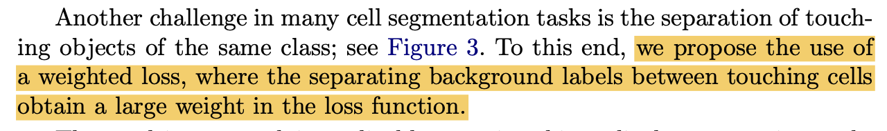
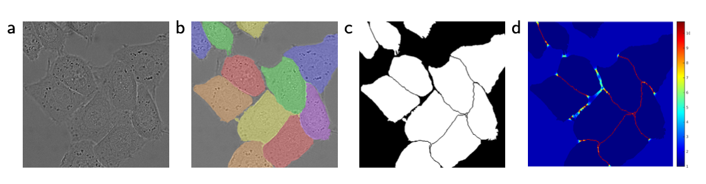
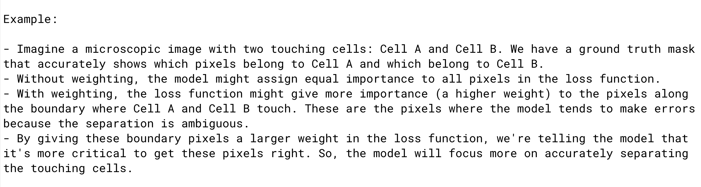

# UNET

U-NET architecture implementation from scratch using PyTorch. 

## Purpose:

The purpose of this repository is to build and train a UNET model on the Oxford Pet Dataset (`torchvision.datasets.OxfordIIITPet`). The model training is done on 4 different combination of configurations. The prediction and loss values are captured for all the variants. This implementation is referenced to the paper `U-Net: Convolutional Networks for Biomedical Image Segmentation`

## How to read this repository?

```
├── README.md
├── UNET.ipynb
├── config.py
├── contracting_block.py
├── data_loader.py
├── download.py
├── expanding_block.py
├── loss.py
├── oxford_dataset.py
├── predictions.py
├── train.py
├── transform.py
├── tree.txt
└── unet.py
```

## About the Oxford Pet dataset

About 37 category pet dataset with roughly 200 images for each class are available. The images have a large variations in scale, pose and lighting. All images have an associated ground truth annotation of breed, head ROI, and pixel level trimap segmentation. Pytorch Library: `torchvision.datasets.OxfordIIITPet`

## Problem Statement:

To develop a image segmentation module for the pet dataset.

## UNET Architecture


### UNET Architecture Explanation
The U-Net architecture is an effective Neural Network architecture, used for Image Segmentation tasks like identifying and deliniating objects within images.

#### Encoder - Decoder Structure
The U-Net architecture can be divided into two main parts: `Encoder` and `Decoder` 

#### Encoder
- The Encoder is the top part of the `U` shape designed to capture features from the input image and gradually reduces the spatial dimension
- It is a series of convolutional layers that work like a funnel, detecting simple features at the top and more complex features as we go deeper in the network. These layers reduces the spatial resolution (`width` and `height`), while increasing the number of channels.
- The Encoder is a **Contraction Path**
    - In the Contraction Path, the model learns `WHAT` features are present in the image. These features can be basic patterns, edges, textures or more complex structures
    - However in this path, we lose some of the spatial information about `WHERE` in the image these features are located, since the spatial dimensions (`width` and `height`) of the feature maps are reduced as we move deeper into the Encoder.
    - Example: When we look at the image of the cat, in the Encoder, the model learns `WHAT` features make up a cat, such as the shapes of ears, the fur texture, and the eyes. But it doesn't precisely know `WHERE` these features are in the original image becuase it has been reduced to lower-resolution feature maps.

#### Decoder
- The Decoder is the bottom part of the `U` shape and designed to expand the feature maps back to the original image size while preserving the important features learned by the Encoder.
- It consists of a series of upsampling and convolutional layers.
- The upsampling layers increase the spatial dimensions, making the feature maps larger.
- The convolutional layers combine the high-level features from the encoder with the upsampled feature maps to generate the final segmentation mask.
- The Decoder is a **Expansion Path**
    - In the expansion path, the model's goal is to figure out `WHAT` those features from the Contraction Path mean in the context of the whole image. It reconstructs the spatial information.
    - The `WHERE` part is resolved in the Expansion Path. The decoder takes the features learned in the contraction path and gradually upsamples them to match the original image's size. Skip connections, which connect corresponding layers in the encoder and decoder, provide "valuable information" about the location of features.
    - Example: In the Expansion Path, the model uses the information it learned earlier "Cat's ears", and places them in the right location on the image, so it knows `WHERE` those features are.
 
#### Skip Connection

To retain the spatial information from the Encoder and send it to the Decoder, the skip connection is used, which is nothing bu the bridge we can see between the `Encoder` and the `Decoder`. This bridge catties the spatial (width, height) information.

#### Bottle Neck Layer

The Layer which connects between the `Encoder` and the `Decoder`. Bottle Neck layer is applied at the end of the Encoder.

#### Output Layer

This is the Final Convolutional Layer, which is responsbile for converting the features from `64` to the output channels = 1. Because, the output will be `background in Black` and the `segmented object in white` color.

### Weighted Loss

Let's understand the `weighted loss` based on the statements mentioned in the paper.



A technique used to train the U-Net model more effectively when dealing with the problem of segmenting objects that are very close to each other, like cells in a microscopy image.



Suppose we have to use a model to seperate and identify each cell. From the above example, some of the cells are so close together that their boundaries touch, making it challenging for the model to distinguish between them accurately.

When two cells touch, the boundary between them becomes ambiguous, and it's challenging for the model to predict the exact separation line correctly. This can lead to errors in segmentation.

To address this challenge, the U-Net paper suggests using a `weighted loss` in the training process. In this case, the `weighted loss` function assigns different levels of importance or `weights` to different parts of the image.



By using this weighted loss, the U-Net model pays special attention to the challenging areas where objects touch (boundary between two different objects), making it more likely to produce a better segmentation result in these complex cases.

## Loss Functions in UNET

Two different loss functions are used in the U-Net Image segmentation architecture

- `Binary Cross-Entropy (BCE) Loss`: In Binary image segmentation, each pixel in the mask can be either a foreground(object) pixel or a background pixel. This loss function measures the dissimilarity between the predicted binary mask and the ground truth binary mask. This enables the model to produce pixel-wise probabilities that are close to the actual binary values (0 or 1).

- `Dice Loss`: This loss function measures the overlap between the predicted and ground truth masks, focusing on the intersection of pixels. It enables the model to generate masks that closely match the ground truth.

                Dice = (2 * Intersection) / (Sum of Pixels in Ground Truth + Sum of Pixels in Predicted)
                Dice = (2 * 2) / (4 + 2) = 4 / 6 = 2/3 ≈ 0.67
                Dice Loss = 1-0.67 = 0.33


